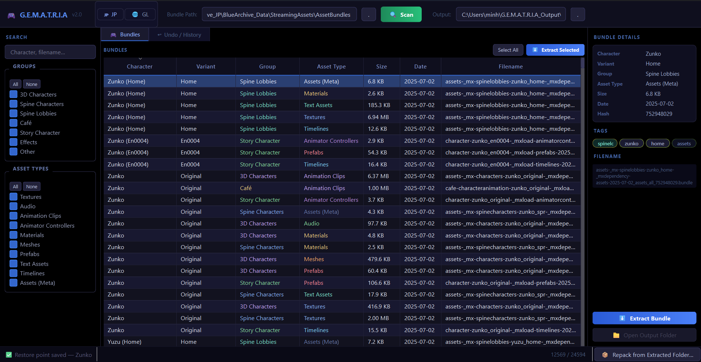

# G.E.M.A.T.R.I.A
### Graphical Environment & Modding Architecture for Total Resource Intervention & Analysis



> *"The world is not what it seems. We are simply here to observe, analyze, and intervene."*

**G.E.M.A.T.R.I.A.** is a high-performance, open-source graphical toolkit designed for the deep analysis, modification, and direct intervention of the **Blue Archive Desktop Client (JP/GL)**. Built with Python and PySide6, this architecture allows researchers, modders, and dataminers to safely interact with the game's internal Unity assets without risking irreversible damage to the sublime truth (your game installation).

---

## 👁️ System Capabilities

Unlike standard unpacking scripts, G.E.M.A.T.R.I.A. provides a unified, visual workspace to safely manipulate Kivotos' underlying architecture.

*   **Total Resource Intervention (Extract & Repack):** Seamlessly unpack Unity `.bundle` files into categorized directories (Textures, AudioClips, TextAssets, MonoBehaviours). Modify them, and repack them into game-ready bundles.
*   **Direct Client Sideloading:** Instantly inject repacked bundles back into the live game directory with a single click.
*   **Chronological Archival (Undo System):** A robust, built-in database that automatically creates compressed snapshots (tar.gz, zstd, 7z) of original game files before any modification. Easily rollback specific files or entire batches via the **Undo / History** tab.
*   **Intelligent Asset Parsing:** Automatically decodes cryptic bundle filenames into human-readable data (Character, Variant, Spine Lobbies, Effects) with a comprehensive tag-based filtering system.
*   **Batch Operations:** Select and extract massive quantities of game assets simultaneously with background thread processing.

---

## 🛠️ Prerequisites & Installation

### Requirements
- Windows 10/11 (x64)
- **Python 3.10** or higher
- Blue Archive Desktop Client (JP or Global)

### Setup
1. Clone or download this repository to your local machine.
2. Open a terminal in the project directory.
3. Install the required dependencies:
   ```bash
   pip install PySide6 UnityPy Pillow
   ```
4. *(Optional but recommended)* Install advanced compression libraries for the Undo System:
   ```bash
   pip install zstandard py7zr
   ```
5. Initiate the environment:
   ```bash
   python main.py
   ```

---

## 🚀 Workflow Protocol (Usage)

### 1. Observation (Scanning)
- Launch G.E.M.A.T.R.I.A. Use the top toggle to select your client version (**🇯🇵 JP** or **🌐 GL**).
- Verify the "Bundle Path" points to your `StreamingAssets/AssetBundles` directory.
- Click **🔍 Scan** to load and parse the game's architecture. Use the left sidebar to filter by character names, asset types (e.g., *Textures*, *Audio*), or groups.

### 2. Intervention (Extraction & Modification)
- Select a bundle and click **⬇ Extract Bundle** (or double-click it). 
- The tool will unpack the assets (PNGs, WAVs, JSONs, etc.) into your Output directory.
- *Note: G.E.M.A.T.R.I.A. silently creates a secure restore point of the original bundle at this stage.*
- Modify the extracted files as desired using standard image/audio/text editors.

### 3. Synthesis (Repacking & Sideloading)
- Click **📦 Repack from Extracted Folder** in the bottom status bar.
- Select the folder containing your modified files (it must contain the `manifest.json` generated during extraction).
- Upon successful repacking, the tool will prompt you to **📲 Install to Game**. Accepting this will safely overwrite the live game file.

### 4. Regression (Restoring)
- Mistakes happen in the pursuit of the Sublime. Navigate to the **↩ Undo / History** tab.
- Select any automated or manual snapshot.
- Click **↩ Restore Selected** to instantly decompress and rollback the game files to their pure, unmodified state.

---

## 🧪 Architecture Layout

| Component | Description | Status |
| :--- | :--- | :--- |
| `main.py` | PySide6 GUI, threading, and user workflow logic. | 🟢 Stable |
| `backend.py` | UnityPy extraction/repacking, bundle manifest parsing. | 🟢 Stable |
| `undo_db.py` | JSON-based snapshot database, hashing, and archive compression. | 🟢 Stable |

---

## ⚠️ Advisory & Disclaimer

**G.E.M.A.T.R.I.A.** is engineered strictly for educational, archival, and client-side research purposes. 
- Modifying game files directly violates Nexon/Yostar's Terms of Service.
- Using modified assets for competitive advantage in Raids/PvP is strictly prohibited and easily detectable.
- The developers of this tool bear no responsibility for account suspensions, bans, or data corruption. 

**Intervene at your own risk, Sensei.**

---

## 🤝 Contributing

We welcome contributions from those who seek the truth within the data.
1. Fork the Project
2. Create your Feature Branch (`git checkout -b feature/DecagrammatonIntegration`)
3. Commit your Changes (`git commit -m 'Added new Unity object support'`)
4. Push to the Branch (`git push origin feature/DecagrammatonIntegration`)
5. Open a Pull Request

---

## 📜 License

Distributed under the GPL3 License. See `LICENSE` for more information.
